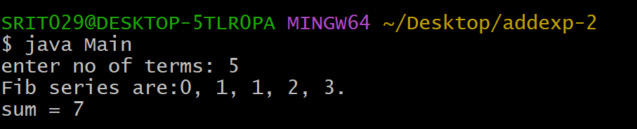
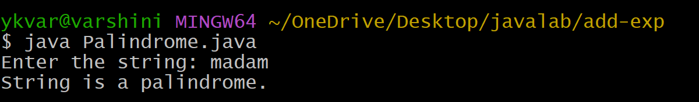
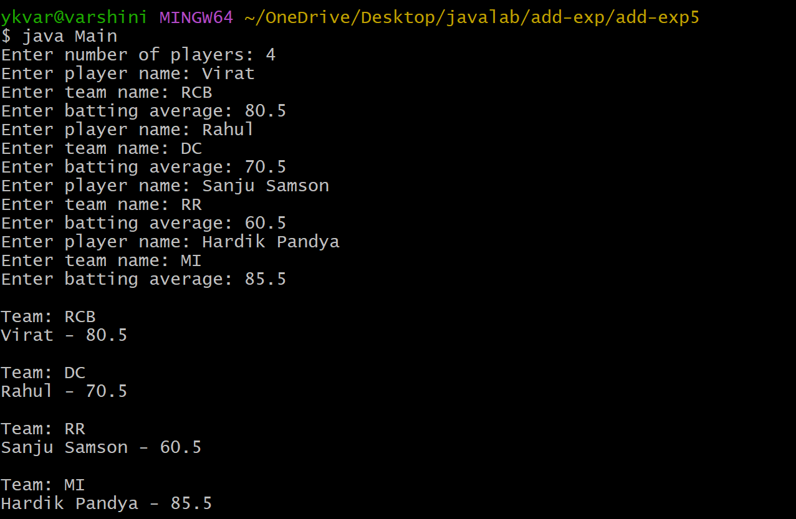

# ADDEXP-2
## Title: sum of the frist n Fibonacci Numbers
## Source Code:
``` java
 class Fibonacci{
    int n,a=0,b=1,c,sum=0;
    Fibonacci(int n){
      this.n = n;
    }
    void printFib(){
      for(int i=1;i<=n;i++){
        if(i==1)
          c = a;
        else if(i==2)
          c = b;
        else{
          c = a+b;
          a = b;
          b = c;
        }
        sum+=c;
        if(i==n)
          System.out.print(c + ".");
        else
          System.out.print(c + ", ");
      }
    }
    int getsum(){
      return sum;
    }
  }
 import java.util.Scanner;
 class Main{
    public static void main(String[] args){
      Scanner sc = new Scanner(System.in);
      System.out.print("enter no of terms: ");
      int n = sc.nextInt();
      if(n>0){
      Fibonacci f = new Fibonacci(n);
      System.out.print("Fib series are:");
      f.printFib();
      System.out.println("\nsum = " + f.getsum());
      }
      else{
           System.out.println("Fibonacci sequence canot be calculated");
      }
   }

 }
```
## Output:


# ADDEXP-1
## Title: To insert a substring into a given main string from a given position.
## Source Code:
``` java
import java.util.Scanner;
class SubStringInsert {
    public static void main(String[] args) {
     String mainString, subString;
        int position;

        Scanner sc = new Scanner(System.in);

        System.out.print("Enter the main string: ");
        mainString = sc.nextLine();
        System.out.print("Enter the sub string: ");
        subString = sc.nextLine();
        System.out.print("Enter the position: ");
        position = sc.nextInt();
        int length = mainString.length();
        String resultString;
        if (position >= 0 && position <= length) {
        String firstPart = mainString.substring(0, position);
        String secondPart = mainString.substring(position);
        resultString = firstPart + subString + secondPart;
        System.out.println("Resultant String = " + resultString);
        } 
        else {
            System.out.println("Substring is not possible to insert");
            System.out.println("Condition: 0 <= position <= length of main string");
        }

        sc.close();
    }
}
```
## Output:


# ADDEXP-3
## Title: To determine if a given string is palindrome or not.
## Source Code:
``` java
import java.util.Scanner;
class Palindrome {
    public static void main(String[] args) {
      String str;
        Scanner sc = new Scanner(System.in);
        System.out.print("Enter the string: ");
        str = sc.nextLine();
        int start = 0;
        int end = str.length() - 1;
        boolean flag = true;
        while (start < end) {
            if (str.charAt(start) != str.charAt(end)) {
                System.out.println("String is not a palindrome.");
                flag = false;
                break;
            }
            start++;
            end--;
        }

        if (flag) {
            System.out.println("String is a palindrome.");
        }

        sc.close();
    }
}
```
## Output:


# ADDEXP-4
## Title: To check if a number is a perfect number.
## Source Code:
``` java
import java.util.Scanner;

public class PerfectNumber {
    public static void main(String[] args) {
        int num, sum = 0;

        Scanner sc = new Scanner(System.in);
        System.out.print("Enter a number: ");
        num = sc.nextInt();
        for (int i = 1; i < num; i++) {
            if (num % i == 0) {
                sum = sum + i;
            }
        }

        if (sum == num) {
            System.out.println(num + " is a perfect number.");
        } else {
            System.out.println(num + " is not a perfect number.");
        }

        sc.close();
    }
}
```
## Output:


# ADDEXP-5
## Title:write a Java program that reads information about all the players and print team-wise list containing names of players with their batting average
## Source Code:
``` java
class Cricket {
    String playerName;
    String teamName;
    double battingAverage;

    Cricket(String playerName, String teamName, double battingAverage) {
        this.playerName = playerName;
        this.teamName = teamName;
        this.battingAverage = battingAverage;
    }

    void display() {
        System.out.println(playerName + " - " + battingAverage);
    }
}
import java.util.Scanner;
class Main {
    public static void main(String[] args) {
        Scanner sc = new Scanner(System.in);

        System.out.print("Enter number of players: ");
        int n = sc.nextInt();
        sc.nextLine();

        Cricket[] players = new Cricket[n];

        for (int i = 0; i < n; i++) {
            System.out.print("Enter player name: ");
            String playerName = sc.nextLine();

            System.out.print("Enter team name: ");
            String teamName = sc.nextLine();

            System.out.print("Enter batting average: ");
            double battingAverage = sc.nextDouble();
            sc.nextLine();

            players[i] = new Cricket(playerName, teamName, battingAverage);
        }

        for (int i = 0; i < n; i++) {
            boolean printed = false;

            for (int k = 0; k < i; k++) {
                if (players[i].teamName.equalsIgnoreCase(players[k].teamName)) {
                    printed = true;
                    break;
                }
            }

            if (!printed) {
                System.out.println("\nTeam: " + players[i].teamName);

                for (int j = 0; j < n; j++) {
                    if (players[j].teamName.equalsIgnoreCase(players[i].teamName)) {
                        players[j].display();
                    }
                }
            }
        }

        sc.close();
    }
}
```
## Output:



