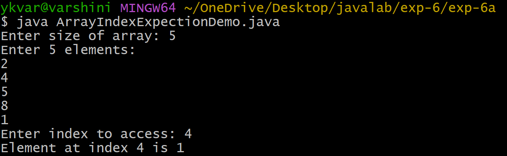
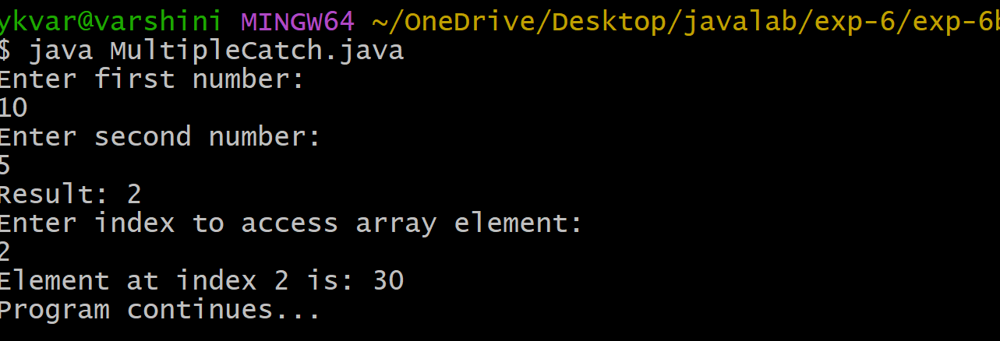
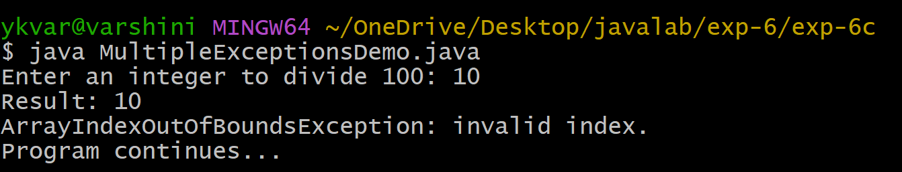

## EXPERIMENT-6a
## Title:Exception handling mechanism.
## SourceCode:
``` java
import java.util.Scanner;

class ArrayIndexExceptionDemo {
    public static void main(String[] args) {
        Scanner sc = new Scanner(System.in);

        System.out.print("Enter size of array: ");
        int n = sc.nextInt();

        int[] arr = new int[n];

        System.out.println("Enter " + n + " elements:");
        for (int i = 0; i < n; i++) {
            arr[i] = sc.nextInt();
        }

        try {
            System.out.print("Enter index to access: ");
            int index = sc.nextInt();
            System.out.println("Element at index " + index + " is " + arr[index]);
        } catch (ArrayIndexOutOfBoundsException e) {
            System.out.println("Array index out of bounds!");
        }

        sc.close();
    }
}
```
## Output:


## EXPERIMENT-6b
## Title:Illustrating Multiple catch clauses.
## SourceCode:
``` java
import java.util.Scanner;
import java.util.InputMismatchException;

class MultipleCatch {
    public static void main(String[] args) {

        Scanner sc = new Scanner(System.in);
        int[] arr = {10, 20, 30};

        try {
            System.out.println("Enter first number:");
            int a = sc.nextInt();

            System.out.println("Enter second number:");
            int b = sc.nextInt();

            int result = a / b;
            System.out.println("Result: " + result);

            System.out.println("Enter index to access array element:");
            int index = sc.nextInt();

            System.out.println("Element at index " + index + " is: " + arr[index]);
        }
        catch (ArithmeticException e) {
            System.out.println("Error: Division by zero is not allowed.");
        }
        catch (InputMismatchException e) {
            System.out.println("Error: Please enter numeric values only.");
        }
        catch (ArrayIndexOutOfBoundsException e) {
            System.out.println("Error: Invalid array index.");
        }

        System.out.println("Program continues...");
        sc.close();
    }
}
```
## Output:


## EXPERIMENT-6c
## Title:Illustrating creation of java bulit in executions scenario.
## SourceCode:
``` java
import java.util.Scanner;

public class MultipleExceptionsDemo {
    public static void main(String[] args) {

        Scanner sc = new Scanner(System.in);

        try {
            System.out.print("Enter an integer to divide 100: ");
            int n = sc.nextInt();
            int result = 100 / n;
            System.out.println("Result: " + result);
            int[] arr = new int[3];
            System.out.println("Accessing element: " + arr[5]);
            System.out.print("Enter a number as text: ");
            sc.nextLine();
            String s = sc.nextLine();
            int num = Integer.parseInt(s);
            System.out.println("Converted number: " + num);
        }
        catch (ArithmeticException e) {
            System.out.println("ArithmeticException: division by zero.");
        }
        catch (ArrayIndexOutOfBoundsException e) {
            System.out.println("ArrayIndexOutOfBoundsException: invalid index.");
        }
        catch (NumberFormatException e) {
            System.out.println("NumberFormatException: invalid numeric format.");
        }
        catch (Exception e) {
            System.out.println("Some other exception occurred.");
        }

        System.out.println("Program continues...");
        sc.close();
    }
}
```
## Output:



