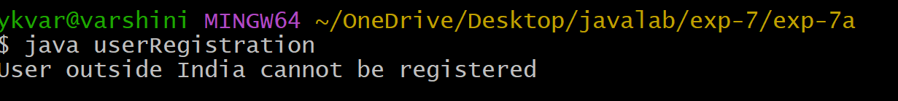
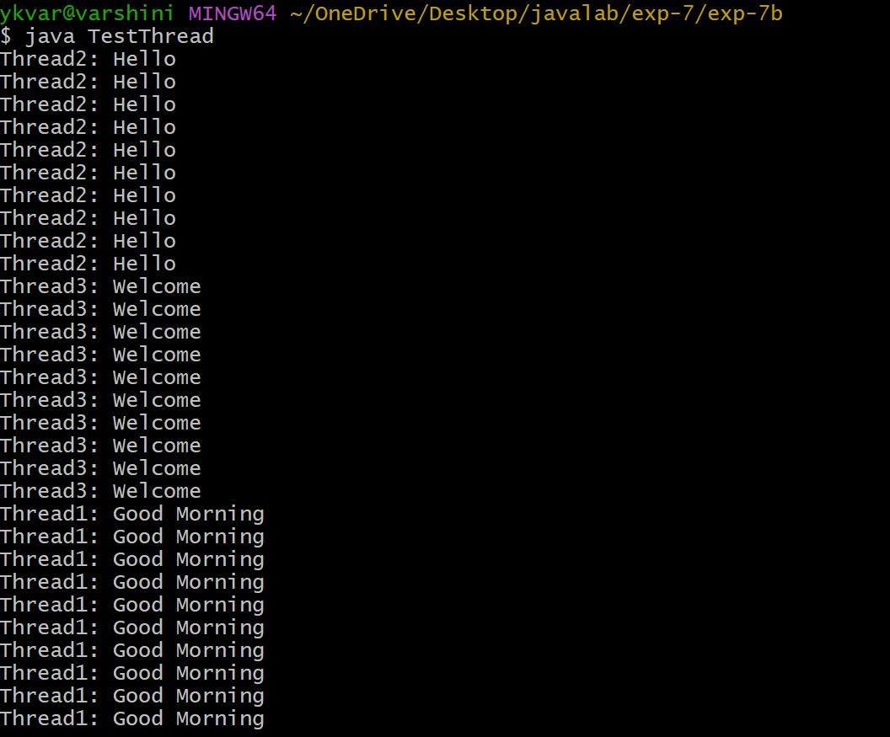
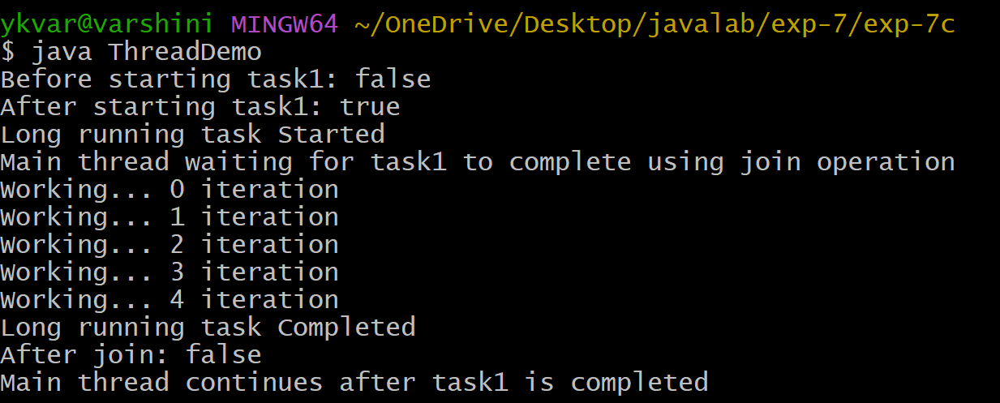

## Experiment-7a
## Title:Creation of User Defined Exception.
## SourceCode:
``` java
class InvalidCountryException extends Exception {
  InvalidCountryException() {
    super();
  }
  InvalidCountryException(String message) {
    super(message);
  }
}
class userRegistration {
  void registerUser(String userName, String userCountry) throws InvalidCountryException {
      if(!userCountry.equals("India")) {
        throw new InvalidCountryException("User outside India cannot be registered");
      }
      else {
        System.out.println("User Registration Done Successfully");
      }
    }

    public static void main(String[] args) {
      userRegistration ur = new userRegistration();
      try {
        ur.registerUser("varshini ", "russia");

      }
      catch(InvalidCountryException e) {
        System.out.println(e.getMessage());
    }
  }
}
```
## Output:


## Experiment-7b
## Title:Creates threads by extending thread class.
## SourceCode:
``` java
class GoodMorningThread extends Thread {
  public void run() {
    for(int i=0; i<10; i++) {
      System.out.println("Thread1: Good Morning ");
    }
    try {
      Thread.sleep(1000);
    }
    catch(Exception e) {
      System.out.println("Exception : " + e);
    }

  }
}
class HelloThread extends Thread {
  public void run() {
    for(int i=0; i<10; i++) {
      System.out.println("Thread2: Hello ");
    }
    try {
      Thread.sleep(2000);
    }
    catch(Exception e) {
      System.out.println("Exception : " + e);
    }
  }
}
class WelcomeThread extends Thread {
  public void run() {
    for(int i=0; i<10; i++) {
      System.out.println("Thread3: Welcome");
    }
    try {
      Thread.sleep(3000);
    }
    catch(Exception e) {
      System.out.println("Exception : " + e);
    }
  }
}
class TestThread {
  public static void main(String[] agrs) {
    GoodMorningThread t1 = new GoodMorningThread();
    HelloThread t2 = new HelloThread();
    WelcomeThread t3 = new WelcomeThread();
    t1.start();
    t2.start();
    t3.start();
  }
}
```
## Output:


## Experiment-7c
## Title:Illustrating is Alive and join().
## SourceCode:
``` java
class LongRunningTask extends Thread {

    public void run() {
        System.out.println("Long running task Started");

        for(int i = 0; i < 5; i++) {
            System.out.println("Working... " + i + " iteration");
            try {
                Thread.sleep(1000);
            }
            catch(Exception e) {
                System.out.println(e);
            }
        }

        System.out.println("Long running task Completed");
    }
}

class ThreadDemo {

    public static void main(String[] args) throws Exception {

        LongRunningTask task1 = new LongRunningTask();

        System.out.println("Before starting task1: " + task1.isAlive());

        task1.start();

        System.out.println("After starting task1: " + task1.isAlive());

        System.out.println("Main thread waiting for task1 to complete using join operation");

        task1.join();

        System.out.println("After join: " + task1.isAlive());

        System.out.println("Main thread continues after task1 is completed");
    }
}
```
## Output:



